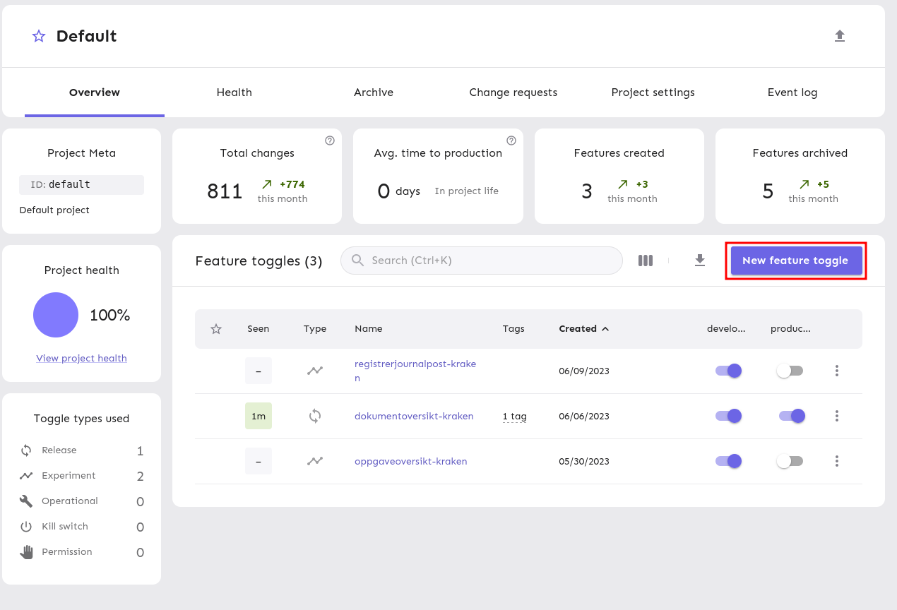
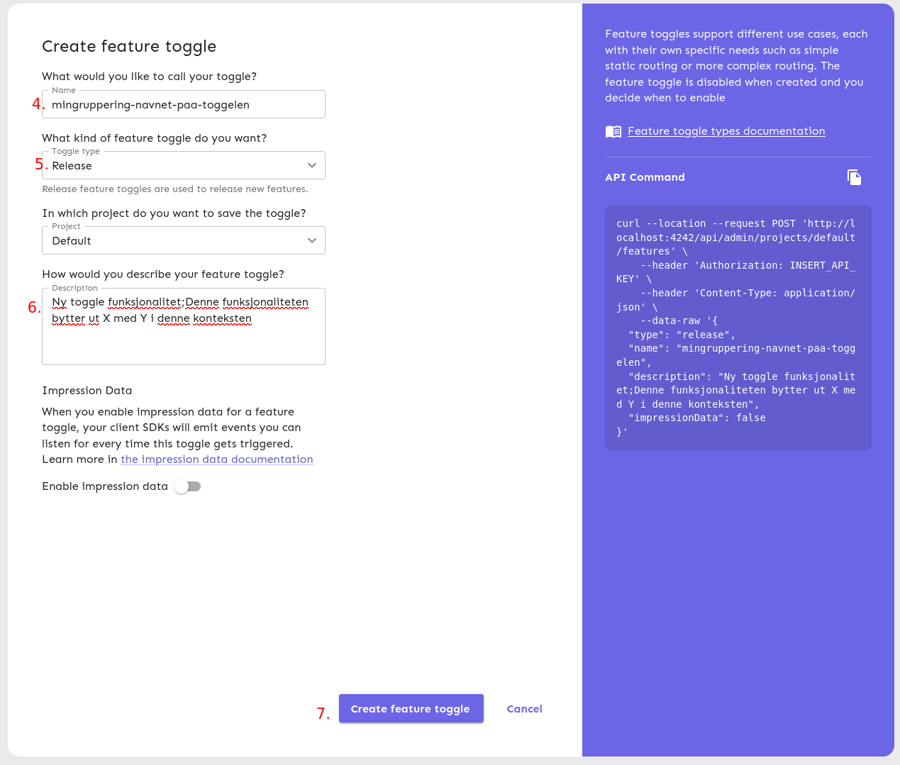
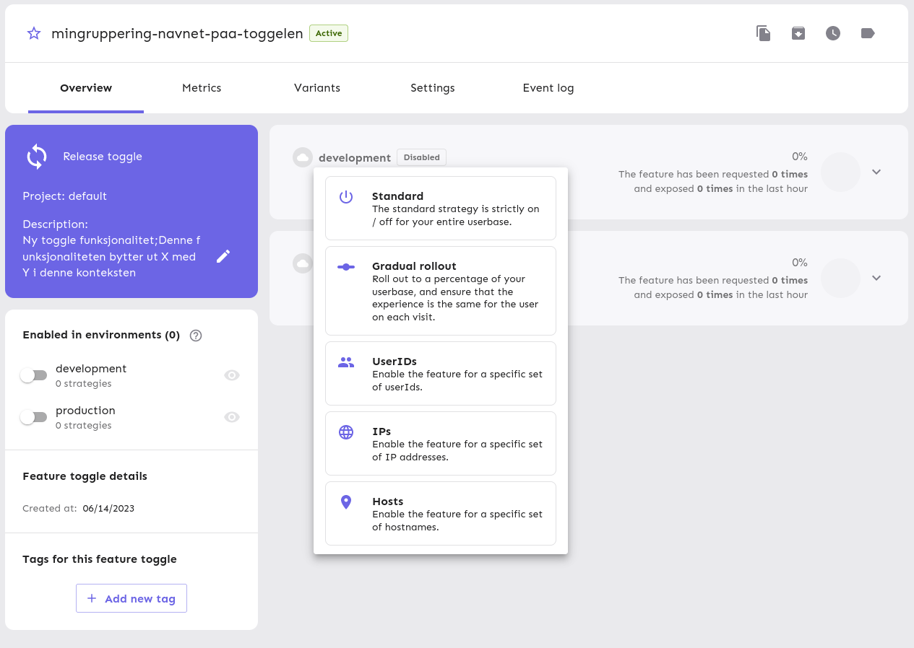
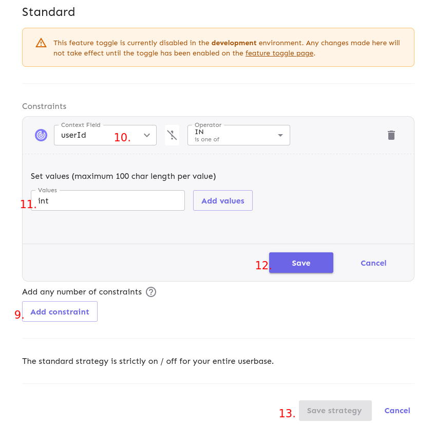
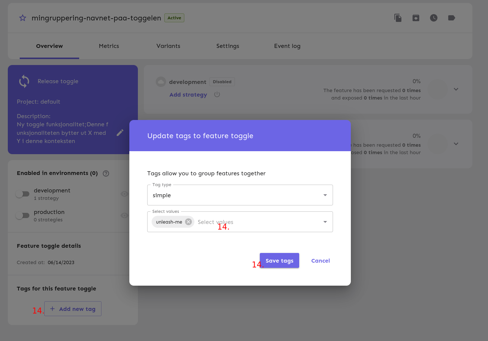
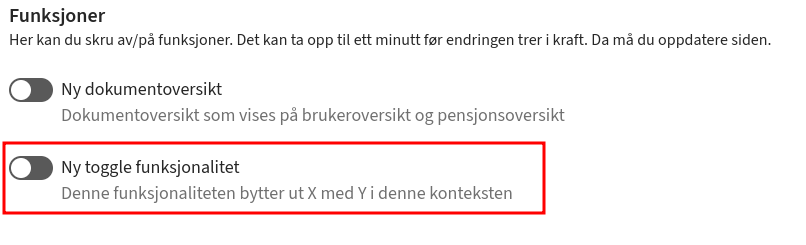

Tilgjengeliggjøre feature toggles fra unleash som self-service

# Sett opp ny toggle

1. Gå inn på ditt team sin unleash (**team**-unleash-web.nav.cloud.nais.io)
2. Velg `Default` prosject
3. Legg til ny feature toggle
   
4. Velg ett beskrivende feature toggle navn som inkluderer navn på din gruppering (lettere å finne ut hvem som eier toggle i ettertid). Kan ikke inneholde **space**, bruk **-** som separator
5. Velg mellom `Realease` og `Expremental` toggle (bytter på hvor den vises i unleash-me)
6. Skriv en beskrivelse som inneholder navnet som skal vises til bruker. Om man ønsker å beskrive togglen ytteligere kan man legge inn en separator `;` som skiller mellom `navn på toggle;mer utfyllende beskrivelse`
7. Trykk **Create feature toggle**
   

8. Opprett **Standard** strategi for **development** miljø med **Add strategy** knappen
   
9. Legg til ny **Constraint** med **Add constraint**
10. Velg **Context field** som **userId** og operator `IN`
11. Legg til en initiell placeholder verdi, f.eks. `int`. Dette er en begresning i unleash at man ikke kan opprette en constraint uten verdier, men det er denne som endres av `unleash-me` og den må være til stedet før fungerer.
12. **Save** constraint
13. **Save strategy**
    

14. Legg til ny **tag** for toggle med **Add new tag**. Denne må matche `UNLEASH_TAG` fra oppsettet av unleash.
    

15. Aktiver strategi for `development` og den vil nå vises i unleash-me for utviklingsmiljø
    
16. Brukere kan nå aktivere og deaktivere denne toggelen som ønsket selv.
17. Strategien kan kopieres til produksjon og vil da også bli tilgjenglig der når miljøet aktiveres.

# Utvikling

## Installer

- docker
- docker-compose
- node >16
- npm

## Unleash oppsett

1. Start lokal unleash: `docker-compose up`
1. Lag ny toggle http://localhost:4242/projects/default/create-toggle
   - Toggle type: _RELEASE_ eller _EXPERIMENTAL_
   - Project: default (eller samme som env. `UNLEASH_PROJECT`)
   - Description: `Det som skal vises til brukeren in unleash-me`
     - Her kan man separere Navn på toggle og ytteligere beskrivelse med `;`, f.eks: "Ny dokumentoversikt;Bytter ut dokumentoversikten som vises på brukeroversikt siden."
1. Enable feature toggle for `development`
1. Legg til tag (må matche enten `UNLEASH_TAG`)
1. Legg til **UserIDs** strategi for toggle

## Oppsett App

1. Sett opp miljøvariabler

   - Lag fil med navn `.env` i `server/` mappen
   - Sett opp miljøvariabler i `.env` fil

   ```env
   UNLEASH_TOKEN=<Admin token fra http://localhost:4242/admin/api/create-token>
   UNLEASH_PROJECT=default
   UNLEASH_TAG=<unleash tag for releases and kill-switch>
   UNLEASH_SERVER=http://localhost:4242 (hvis du skal utvikle lokalt, overskrives for lokal test i docker-compose.yaml)
   UNLEASH_ENVIRONMENT=<matcher miljø i unleash (development/production)
   ```

## Lokal test

1. Gå inn på `http://localhost:8081`

## Lokal utvikling

1. Kjør `npm install` som installerer avhengigheter
1. Sett opp miljøvariabler

   - Lag fil med navn `.env` i `server/` mappen
   - Sett opp miljøvariabler i `.env` fil

   ```env
   UNLEASH_TOKEN=<Admin token fra http://localhost:4242/admin/api/create-token>
   UNLEASH_SERVER=http://localhost:4242
   UNLEASH_PROJECT=default
   UNLEASH_TAG=<unleash tag for releases and expremental>
   UNLEASH_ENVIRONMENT=development
   ```

1. Start miljø

   - Start unleash: `docker-compose up web db` (kan nås på http://localhost:4242, user: admin pw:unleash4all)
   - Start backend: `npm run start:server` (starter på http://localhost:8080)
   - Start frontend `npm run start:client` (kan nås på localhost:5173)
